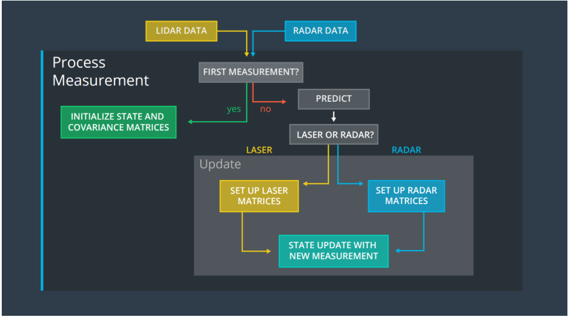

# :checkered_flag: Project 4: Extended Kalman Filter

Key Concepts: Sensor Fusion, Extended Kalman Filter, Tracking

  

The Kalman Filter algorithm will go through the following steps:

<ul>
<li>first measurement - the filter will receive initial measurements of the bicycle's position relative to the car. These measurements will come from a radar or lidar sensor.</li>
<li>initialize state and covariance matrices - the filter will initialize the bicycle's position based on the first measurement.
then the car will receive another sensor measurement after a time period Δt.</li>
<li>predict - the algorithm will predict where the bicycle will be after time Δt. One basic way to predict the bicycle location after Δt is to assume the bicycle's velocity is constant; thus the bicycle will have moved velocity *Δt. In the extended Kalman filter lesson, we will assume the velocity is constant.</li>
<li>update - the filter compares the "predicted" location with what the sensor measurement says. The predicted location and the measured location are combined to give an updated location. The Kalman filter will put more weight on either the predicted location or the measured location depending on the uncertainty of each value.</li>
then the car will receive another sensor measurement after a time period Δt. The algorithm then does another predict and update step.
</ul>

### Overview 

In this project, I implemented the Extended Kalman Filter algorithm to estimate and track the state of a moving object of interest, ie. a bicyle which travels around the vehicle with noisy lidar and radar measurements. To evaluate the performance of tracking, I calculated the RMSE (root mean square erro) value of each state and make sure that are lower than the tolerance outlined in the project rubric. 

### Code Structure
The c++ src code covers 3 main steps for programming a Kalman Filter:

<ul>
  <li> <b>intializing</b> - intializing Kalman filter variables </li>
  <li> <b>Motion Prediction</b> - predicting where our object is going to be after a time step, Δt </li>
  <li> <b>Measurement Update</b> - updating where our object is based on sensor measurements </li>
</ul>

    |- src                             # source code folder
    |
    │   ├── main.cpp                   # receive data measurement, calls Kalman Filter func, calls RMSE func
    │     
    │   ├── FunctionEKF.cpp            # initialize the filter, calls Prediction func, calls Update func, via ekf_ instanse
    │
    │   ├── kalman_filter.cpp          # define Prediction func, Update func for lidar, Update func for radar
    │
    │   ├── tools.cpp                  # define RMSE func, Jacobian func to linearize radar measurements
    │
    │   ├── measurement_package.h      # define raw measurement data types
    │
    |- data
    │   ├── obj_pose-laser-radar-synthetic-input.txt      
    |   # R(Radar):  raw measurement data types sensor_type, rho_measured, phi_measured, rhodot_measured, timestamp, x_groundtruth, y_groundtruth, vxgroundtruth, vy_groundtruth, yaw_groundtruth, yawrate_groundtruth.
    |   # L(Lidar):  sensor_type, x_measured, y_measured, timestamp, x_groundtruth, y_groundtruth, vx_groundtruth, vy_groundtruth, yaw_groundtruth, yawrate_groundtruth.
    

### Dependencies
Keep in mind that the minimum project dependency versions are:

cmake: 3.5

All OSes: click here for installation instructions

make: 4.1

Linux: make is installed by default on most Linux distros
Mac: install Xcode command line tools to get make
Windows: Click here for installation instructions

gcc/g++: 5.4

Linux: gcc / g++ is installed by default on most Linux distros
Mac: same deal as make - install Xcode command line tools
Windows: recommend using MinGW

### Basic Build Instructions

1. Clone this repo.
2. Make a build directory: `mkdir build && cd build`
3. Compile: `cmake .. && make` 
   * On windows, you may need to run: `cmake .. -G "Unix Makefiles" && make`
4. Run it: `./ExtendedKF `

### Result Description

Radar measurements are blue circles with an arrow pointing in the direction of the observed angle, and estimation markers are green triangles. The video below shows what the simulator looks like when a c++ script is using its Kalman filter to track the object. The simulator provides the script the measured data (either lidar or radar), and the script feeds back the measured estimation marker, and RMSE values from its Kalman fil

### Project Rubric

EKF Estimation Algorithm against Dataset1

EKF Estimation Algorithm against Dataset2

## Other references

uWebSocketIO Starter Guide

This repository includes two files that can be used to set up and install [uWebSocketIO](https://github.com/uWebSockets/uWebSockets) for either Linux or Mac systems. For windows you can use either Docker, VMware, or even [Windows 10 Bash on Ubuntu](https://www.howtogeek.com/249966/how-to-install-and-use-the-linux-bash-shell-on-windows-10/) to install uWebSocketIO. Please see the uWebSocketIO Starter Guide page in the classroom within the EKF Project lesson for the required version and installation scripts.

Once the install for uWebSocketIO is complete, the main program can be built and run by doing the following from the project top directory.

1. mkdir build
2. cd build
3. cmake ..
4. make
5. ./ExtendedKF

This project involve using an open source package called uWebSocketIO. This package facilitates the same connection between the simulator and code that was used in the Term 1 Behavioral Cloning Project, but now with C++. The package does this by setting up a web socket server connection from the C++ program to the simulator, which acts as the host. In the project repository there are two scripts for installing uWebSocketIO - one for Linux and the other for macOS.

Note: Only uWebSocketIO branch e94b6e1, which the scripts reference, is compatible with the package installation.

Linux Installation:

From the project repository directory run the script: install-ubuntu.sh

Mac Installation:

From the project repository directory run the script: install-mac.sh

Some users report needing to use cmakepatch.txt which is automatically referenced and is also located in the project repository directory.

Windows Installation:

Although it is possible to install uWebSocketIO to native Windows, the process is quite involved. Instead, you can use one of several Linux-like environments on Windows to install and run the package.

Bash on Windows:

One of the newest features to Windows 10 users is an Ubuntu Bash environment that works great and is easy to setup and use. Here is a nice step by step guide for setting up the utility.

We recommend using the newest version of Ubunut Bash 16.04, which is able to run the install-ubuntu.sh script without complications. The link here can help you check which version of Ubuntu Bash you are running, and also help you upgrade if you need to.

Docker:

If you don't want to use Bash on Windows, or you don't have Windows 10, then you can use a virtual machine to run a Docker image that already contains all the project dependencies.

First install Docker Toolbox for Windows.

Next, launch the Docker Quickstart Terminal. The default Linux virtual environment should load up. You can test that Docker is setup correctly by running docker version and docker ps.

You can enter a Docker image that has all the project dependencies by running:

docker run -it -p 4567:4567 -v 'pwd':/work udacity/controls_kit:latest

Once inside Docker you can clone over the GitHub project repositories and run the project from there.
