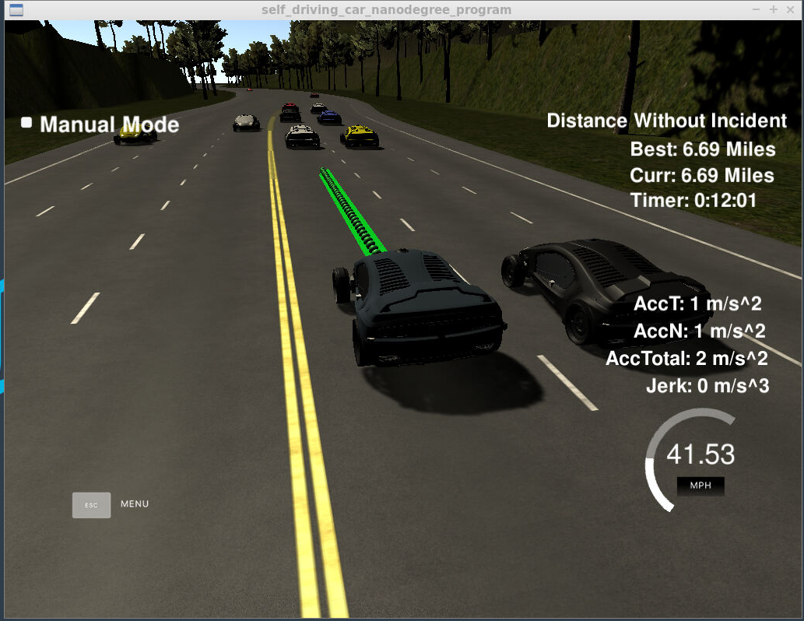

# :checkered_flag: Project 6: Highway Driving - Prediction & Path Planning

[](http://www.udacity.com/drive)

Key Concepts: Prediction,Behavior Planning with Finite State Machines (FSM) and cost funtion, Polynomial Trajectory Generation, Sensor Fusion, Frenet Coordiante.

<hr>

### Overview

In this project, the goal is to design a path planner that is able to safely navigate around a virtual 3-lane highway with other traffic that is driving +-10 MPH of the 50 MPH speed limit. To accomplish this goal, A path planner is designed to create smooth, safe paths for the ego car to follow along inside its lane, avoid hitting other cars, and pass slower moving traffic all by using localization, sensor fusion, and map data. The car should try to go as close as possible to the 50 MPH (22.35m/s) speed limit, which means passing slower traffic when possible, note that other cars will try to change lanes too. The car should avoid hitting other cars at all cost as well as driving inside of the marked road lanes at all times, unless going from one lane to another. The car should be able to make one complete loop around the 4.3mile (6946m) highway. Since the car is trying to go 50 MPH, it should take a little over 5 minutes to complete 1 loop. Also the car should not experience total acceleration over 10 m/s^2 and jerk that is greater than 10 m/s^3 for the consideration of safet0y and comfort.

### Results
#### Vehicle Changing Lane


<div align="center">

</div>

#### Distance & Time without Incident 
The vehicle has been driving safely 6.69 miles which is over the preset highway distance, 4.3mile (6946m) without incidents.


<div align="center">

</div>


#### Detailed Video Link

<a href="https://www.youtube.com/watch?v=NSgxW-0lui8" target="_blank"> &nbsp;<span style="line-height=50px">Youtube Link</span></a>

### Project Rubrics

```
(Will be filled in after the Submission Review)
```

### Prerequisites

####   Simulator.
You can download the Term3 Simulator which contains the Path Planning Project from the [releases tab (https://github.com/udacity/self-driving-car-sim/releases/tag/T3_v1.2).  

To run the simulator on Mac/Linux, first make the binary file executable with the following command:
```shell
sudo chmod u+x {simulator_file_name}
```

####   The map of the highway is in data/highway_map.txt
Each waypoint in the list contains  [x,y,s,dx,dy] values. x and y are the waypoint's map coordinate position, the s value is the distance along the road to get to that waypoint in meters, the dx and dy values define the unit normal vector pointing outward of the highway loop.

The highway's waypoints loop around so the frenet s value, distance along the road, goes from 0 to 6945.554.

####   Dependencies

* cmake >= 3.5
  * All OSes: [click here for installation instructions](https://cmake.org/install/)
* make >= 4.1
  * Linux: make is installed by default on most Linux distros
  * Mac: [install Xcode command line tools to get make](https://developer.apple.com/xcode/features/)
  * Windows: [Click here for installation instructions](http://gnuwin32.sourceforge.net/packages/make.htm)
* gcc/g++ >= 5.4
  * Linux: gcc / g++ is installed by default on most Linux distros
  * Mac: same deal as make - [install Xcode command line tools]((https://developer.apple.com/xcode/features/)
  * Windows: recommend using [MinGW](http://www.mingw.org/)
* [uWebSockets](https://github.com/uWebSockets/uWebSockets)
  * Run either `install-mac.sh` or `install-ubuntu.sh`.
  * If you install from source, checkout to commit `e94b6e1`, i.e.
    ```
    git clone https://github.com/uWebSockets/uWebSockets 
    cd uWebSockets
    git checkout e94b6e1
    ```
    
### Basic Build Instructions

1. Clone this repo.
2. Make a build directory: `mkdir build && cd build`
3. Compile: `cmake .. && make`
4. Run it: `./path_planning`.


### Code Description

#### Localization Data (No Noise)
| Localization Data         		|     Description	        					| 
|:---------------------:|:---------------------------------------------:| 
| ["x"]       		| The car's x position in map coordinates   							| 
| ["y"]        	| The car's y position in map coordinates 	|
| ["s"]		     		| The car's s position in frenet coordinates												|
| ["d"]	       	| The car's d position in frenet coordinates				|
| ["yaw"]	      | The car's yaw angle in the map			|
| ["speed"]					| The car's speed in MPH												|


#### Previous path data given to the Planner

```
//Note: Return the previous list but with processed points removed, can be a nice tool to show how far along
the path has processed since last time. 

["previous_path_x"] The previous list of x points previously given to the simulator

["previous_path_y"] The previous list of y points previously given to the simulator

#### Previous path's end s and d values 

["end_path_s"] The previous list's last point's frenet s value

["end_path_d"] The previous list's last point's frenet d value
```

#### Sensor Fusion Data, a list of all other car's attributes on the same side of the road. (No Noise)
```

["sensor_fusion"] A 2d vector of cars and then that car's [car's unique ID, car's x position in map coordinates, car's y position in map coordinates, car's x velocity in m/s, car's y velocity in m/s, car's s position in frenet coordinates, car's d position in frenet coordinates. 
```

#### Lane Change Logic

The behavior of the ego vehicle is predicted based on the driving situations of cars around it. By iterating sensor_fusion variable , which contains all the information about the cars on the right-hand side of the road, first we need to figure out which lane {0:Left, 1: Middle, 2: Right} this certain checked vehicle is on. Then the problem falls into 3 sections. 

<ul>
<li>If the ego_vehicle is in the same lane with checked_vehilce, we need to see if the distance is less than safety_cushion. If not, the ego_car is safe to increase its speed to be close to the speed limit, 50mph. But if the distance is less, we need to jump to the following steps. </li> 

<li> The left_lane is checked first because left is the fast lane so we want the ego_vehicle to shift to fast lane first without decreasing speed. By checking feasibility, we need to check if there the current lane is in the left lane in this way no further left lane to go && if there is a close car in left lane. </li> 

<li> If left_lane change scheme does not work, we use the same logic to check the right lane. We need to check if there the current lane is in the right lane in this way no further right lane to go && if there is a close car in right lane. </li> 

<li> Really, both change schemes of left_change and right_change do not work. We have no choice to be stuck in the current lane and decrease its speed to avoid collisions.</li> 

</ul>

### Details

1. The car uses a perfect controller and will visit every (x,y) point it recieves in the list every .02 seconds. The units for the (x,y) points are in meters and the spacing of the points determines the speed of the car. The vector going from a point to the next point in the list dictates the angle of the car. Acceleration both in the tangential and normal directions is measured along with the jerk, the rate of change of total Acceleration. The (x,y) point paths that the planner recieves should not have a total acceleration that goes over 10 m/s^2, also the jerk should not go over 50 m/s^3. (NOTE: As this is BETA, these requirements might change. Also currently jerk is over a .02 second interval, it would probably be better to average total acceleration over 1 second and measure jerk from that.

2. There will be some latency between the simulator running and the path planner returning a path, with optimized code usually its not very long maybe just 1-3 time steps. During this delay the simulator will continue using points that it was last given, because of this its a good idea to store the last points you have used so you can have a smooth transition. previous_path_x, and previous_path_y can be helpful for this transition since they show the last points given to the simulator controller with the processed points already removed. You would either return a path that extends this previous path or make sure to create a new path that has a smooth transition with this last path.

### Tips

A really helpful resource for doing this project and creating smooth trajectories was using http://kluge.in-chemnitz.de/opensource/spline/, the spline function is in a single hearder file is really easy to use.

